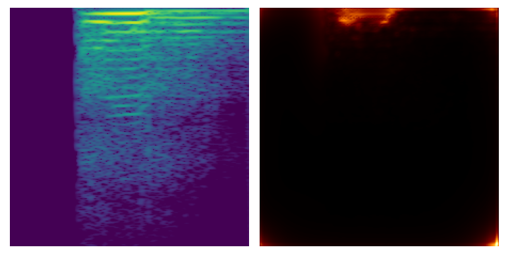

# ExAMod
Code for Explainable Audio Models (ExAMod)

Below is an exmaple explanation for the acciacatura playing technique performed by Player 3 using the G flute. Left: spectrogram; right: LRP score visualization.

