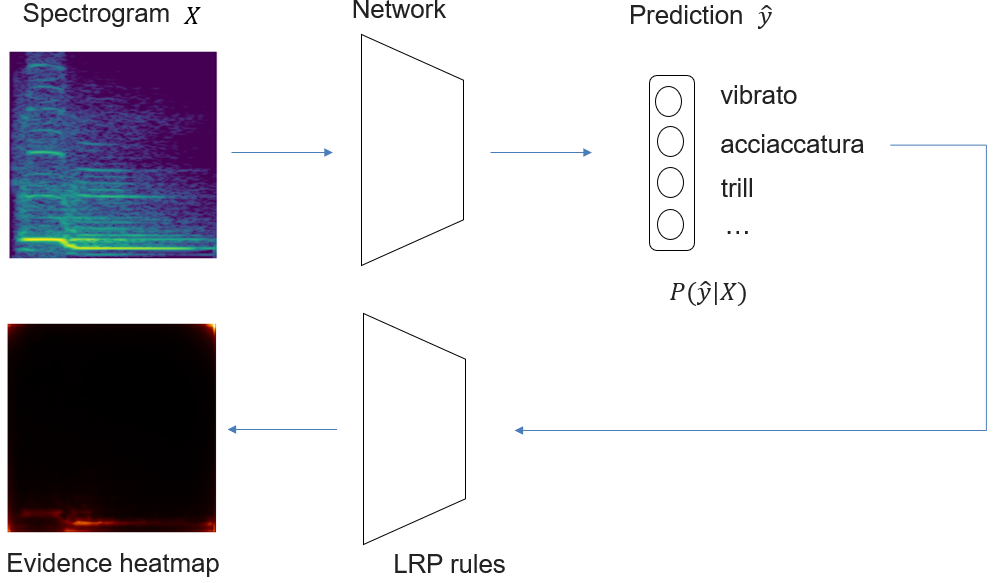

# ExAMod
Code for Explainable Audio Models (ExAMod).

The idea of this project is to develop an explanation framework for audio deep learning models based on the  [layer-wise relevance propagation](https://github.com/sebastian-lapuschkin/lrp_toolbox) (LRP). This method associates a relevance score to each neural and propagates the output backwards by propagation rules layer-by-layer to the input. By visualizing the relevance scores as a heatmap, we evidence the contribution of each feature in the input. Despite the wide use of LRP in image and NLP, there is little LRP research on audio networks. In this project, we explore the applicability of this method to audio signals. For audio signals, the input can be any time--frequency representation such as spectrogram, CQT, and scattering transform. The pipeline can be simplified as below using the spectrogram of an acciacatura playing technique as an example:

A list of example explanations generated from the pretrained vgg16 network can be found in `output/`.
