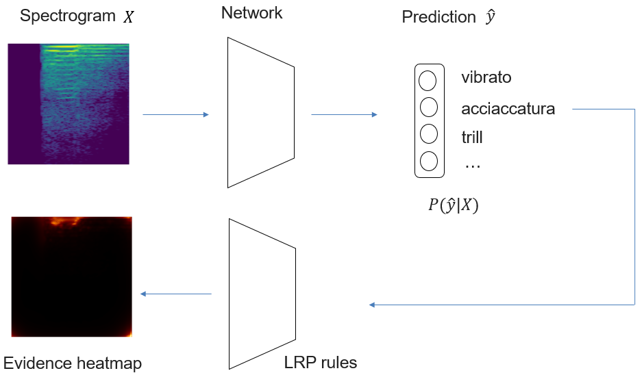
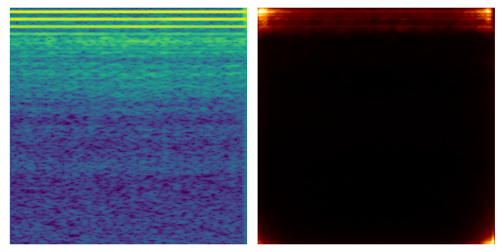

# ExAMod
Code for Explainable Audio Models (ExAMod).

The idea of this project is to develop an explanation framework for audio deep learning models based on the layer-wise relevance propagation (LRP). This method associates a relevance score to each neural and propagates the output backwards by propagation rules layer-by-layer to the input. By visualizing the relevance scores as a heatmap, we evidence the contribution of each feature in the input. For audio signals, the input can be any time--frequency representation such as spectrogram, CQT, and scattering transform. The pipeline can be simplified as below using the spectrogram of an acciacatura playing technique as an example:

Below is two exmaple explanations using the pretrained vgg16 network:
<1> an acciacatura playing technique performed by Player 3 using the G flute. Left: spectrogram; right: LRP score visualization.

<2> a vibrato playing technique performed by Player 7 using the G flute. Left: spectrogram; right: LRP score visualization.

