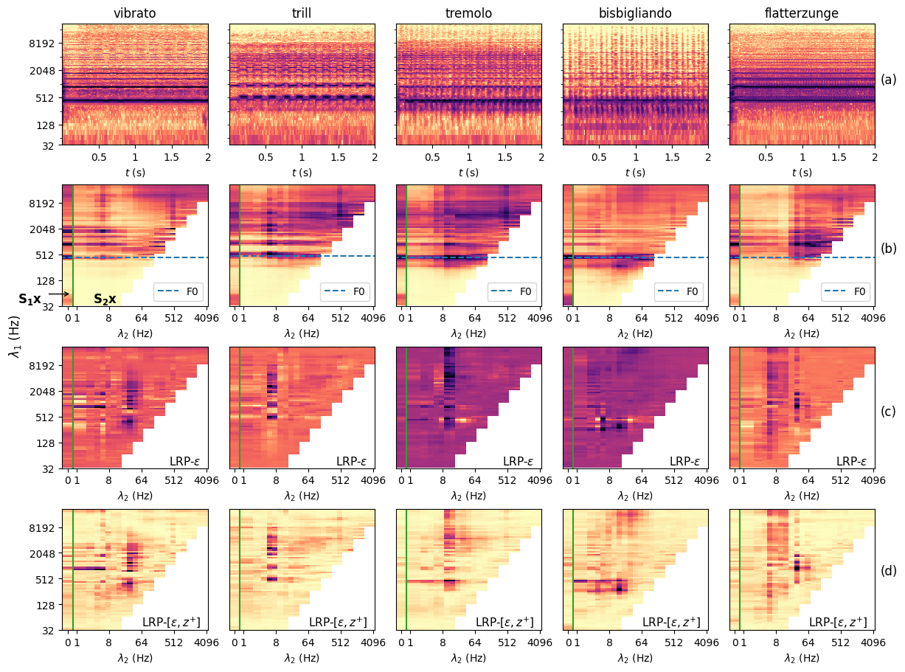

# Explainable Audio Models (ExAMod)

Code for the paper: Changhong Wang, Vincent Lostanlen, and Mathieu Lagrange. [Explainable Audio Classification of Playing Techniques with Layer-wise Relevance Propoagation](https://.pdf), submitted to [IEEE International Conference on Acoustics, Speech and Signal Processing](https://2023.ieeeicassp.org/) (ICASSP), 2023.

## Main idea


<ul class="bodyColum2"> 
  <strong>Vibrato</strong> <br>
  <audio controls height="40px" width="100px">
     <source src="https://user-images.githubusercontent.com/changhongw/examod/results/Bn-flatt-A4-mf.mp4" type="audio/mpeg">
     <embed height="50" width="60" src="https://user-images.githubusercontent.com/changhongw/examod/results/Bn-flatt-A4-mf.mp4">
  </audio> <br>
</ul>


<video src="https://user-images.githubusercontent.com/changhongw/examod/results/Bn-flatt-A4-mf.mp4"></video>

## How to run
### Get code
`git clone https://github.com/changhongw/ExAMod.git`

### Install dependencies
`conda create -n myenv python=3.9.7`<br>
`conda install --file requirements.txt`

### Data
This work uses the [Studio On Line](https://forum.ircam.fr/collections/detail/sol-instrumental-sounds-datasets/) (SOL) dataset (version 0.9HQ). The meta data used are generated by `0_data_meta.ipynb`, including the training, validation, and test split.

### Carrier-modulation feature map extraction
`python 1_preprocess_feature.py`

### Playing technique classification
- train and test network
`2_classification.py`

- check classification result
`3_classification_results.ipynb`

### Explanation maps
- Local evidence map
`4_local_relevance_maps.ipynb`

- Class-wise aggregation
`5_classwise_aggregation.ipynb`

## Citation
```

```
